# 解题思路
本题使用**有限状态机**。根据**字符类型**和**合法数值的特点**，先定义**状态**，再画出**状态转移图**，最后编写**代码**。

# 字符类型
1. 空格: *' '*
2. 正负号：*+-*
3. 数字: *0-9*
4. 小数点：*.*
5. 幂符号：*eE*

|字符类型|char|
|---|---|
|空格|' '|
|符号|'s'|
|数字|'d'|
|小数点|'.'|
|字符eE|'e'|

# 状态定义：
按照字符类型和数值特点，按照字符串从左到右的顺序给出以下9种状态定义：
> 在状态定义前，需要明确状态定义的一大原则：
> 1. 一个状态要么是接受状态要么是不接受状态
0. 起始的空格
1. 符号位
2. 整数部分
3. 左侧有整数的小数点
4. 左侧无整数的小数点
5. 小数部分
6. 字符eE
7. 指数部分的符号位
8. 整数部分
9. 末尾的空格

# 结束状态：
合法的结束状态有*2、3、5、8、9*

# 状态转移图：

# 算法流程：
## 1. 初始化:
- 状态转移表`state`：设`state[i]`,其中`i`为所处状态，`state[i]`使用哈希表`unordered<char,int>`存储可以转移至的状态。键值对`(key,value)`含义：若输入`key`，则可从状态`i`转移至状态`value`
- 当前状态`curState`:起始初始化为`curState=0`
## 2. 状态转移循环
遍历字符串的每个字符`c`
- 记录字符类型`charType`:分为五种情况
  - `if c=' ',charType=c`
  - `if c='+'or'-',charType='s'`
  - `if c='0'~'9',charType='d'`
  - `if c='.',charType=c`
  - `if c='e'or'E',charType='e'`
- 终止条件：若字符类型`charType`不在哈希表`state[curState]`中，说明无法转移至下一状态，因此直接返回`False`
- 状态转移：状态`curState`转移至`state[curState][charType]`
## 3. 返回值
跳出循环后，若状态
$$curState\in\{2,3,5,8,9\}$$
则返回`True`;否则，返回`False`

