# 解题思路
利用**有限状态机**的思想，先找出所有**字符类型**，按字符串从左到右的顺序定义所有**状态**，最后画出**状态转移图**，最后**编写代码**

# 字符类型
1. 空格
2. 正负号
3. 数字

# 状态定义
>注意：状态的定义要包括所有接受状态的所有前置状态
0. 起始的空格
1. 正负号
2. 整数部分

# 状态转移图

# 代码思路
## 1. 初始化
- 状态表`state`:设`state[i]`,其中`i`表示所处状态,`state[i]`用哈希表`unordered_map<char,int>`存储可以转移至的状态;键值对`{key,value}`表示：若输入`key`,则可以从状态`i`转移至状态`value`;
- 当前状态`curState`：初始化为`0`
- 符号位`sign`:初始化为`1`
- 结果`result`:初始化为`0`
## 2. 状态转移
- 字符预处理：
  - `if c=' ',charType=c`
  - `if c='+'or'-',charType='s'`
  - `if c='0'~'9',charType='d'`
- 终止条件：如果`charType`不在哈希表`state[curState]`中，则转移失败，跳出循环
- 状态转移： `curState`转移至`state[curState][charType]`
- 更新结果：
  - 如果`curState=1`，那么`sign=c=='+'?1:-1`
  - 如果`curState=2`,那么
    - 判断越界
      - 如果`result>214748364`，那么`return sign==1?INT_MAX:INT_MIN`
      - 如果`result==214748364&&c>'7'`，那么`return return sign==1?INT_MAX:INT_MIN`
    - 不会越界，更新`result=result*10+c-'0'`
## 3. 返回值
返回`sign*result`